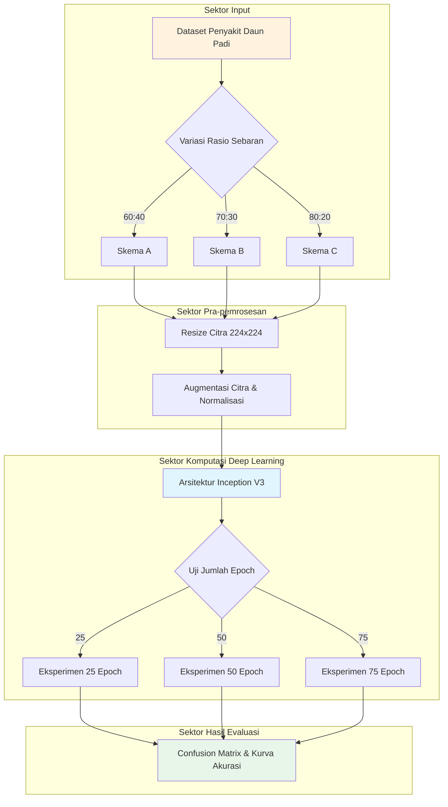

# Arsitektur dan Skema Sistem — Evaluasi Komparatif Express.js vs Gin

## 1. Gambaran Umum Arsitektur

Eksperimen deep learning ini dijalankan dalam sebuah arsitektur pipeline komputasi terisolasi (menggunakan environment Python berbasis pustaka TensorFlow/Keras) yang memproses data mentah citra daun padi hingga menghasilkan metrik evaluasi klasifikasi:

```
┌────────────────────────────────────────────────────────────────────────┐
│                        Deep Learning Pipeline System                   │
│                                                                        │
│  ┌─────────────────┐      ┌──────────────────┐      ┌───────────────┐  │
│  │   Dataset Citra │      │ Pra-pemrosesan   │      │ Model Inti    │  │
│  │   Daun Padi     ├───►  │ & Augmentasi     ├───►  │ Inception V3  │  │
│  │   (3 Kategori)  │      │ (Resize 224x224) │      │ (Arsitektur)  │  │
│  └─────────────────┘      └──────────────────┘      └───────┬───────┘  │
│                                                             │          │
│                                                             ▼          │
│  ┌─────────────────┐      ┌──────────────────┐      ┌───────────────┐  │
│  │ Output Evaluasi │      │ Evaluasi Metrik  │      │ Training &    │  │
│  │ (Grafik & Log)  │◄───  │ Confusion Matrix │◄───  │ Validasi      │  │
│  │                 │      │ (Akurasi, Loss)  │      │ (Var. Epoch)  │  │
│  └─────────────────┘      └──────────────────┘      └───────────────┘  │
└────────────────────────────────────────────────────────────────────────┘
```

## 2. Komponen Aplikasi

### 2.1. Dataset Penyakit Daun Padi

- **Kategori Citra**: Terdiri dari 3 kelas utama gejala infeksi penyakit tanaman padi:
    1. Bacterial Leaf Blight (Hawar Daun Bakteri)
    2. Brown Spot (Bercak Cokelat)
    3. Leaf Smut (Gosong Palsu / Jamur)
- **Format Berkas**: Gambar digital dalam kompresi format .jpg atau .png.

### 2.2. Spesifikasi Pipeline Deep Learning

- **Framework**: TensorFlow 2.x dengan High-Level API Keras.
- **Arsitektur Base-Model**: Inception V3 (menggunakan teknik Transfer Learning / bobot prapelatihan ImageNet).
- **Modifikasi Top-Layer (Head):**: PostgreSQL via GORM
    1. Global Average Pooling 2D untuk mereduksi dimensi matriks fitur
    2. Dense Layer (Dense Fully-Connected) dengan fungsi aktivasi ReLU.
    3. Output Layer menggunakan 3 neurons dengan fungsi aktivasi Softmax untuk klasifikasi multi-kelas.

## 3. Skema Pembagian Data & Pola Pengujian


### 3.1. Variasi Distribusi Sebaran Data (Data Splitting)

Untuk menguji sensitivitas model terhadap volume data latih, dataset dibagi menggunakan tiga skema rasio yang berbeda:

```
|Skenario Sebaran|	Data Training (Pelatihan)|	Data Validation (Validasi)|
|Skema A (60:40)|	60% dari total dataset|	40% dari total dataset|
|Skema B (70:30)|	70% dari total dataset|	30% dari total dataset|
|Skema C (80:20)|	80% dari total dataset|	20% dari total dataset|
```

### 3.2. Skenario Matriks Pengujian Variasi Epoch

```
|Skenario Iterasi |Jumlah Iterasi (Epoch) | Optimizer & Loss Function |
|-----------------|-----------------------|---------------------------|
|Eksperimen_25    |25  Epoch              |Adam /Categorical Crossentropy|
|Eksperimen_50    |50 Epoch               |Adam /Categorical Crossentropy|
Eksperimen_75     |   75 Epoch            |Adam / Categorical Crossentropy|
```

## 4. Alur Pemrosesan Data (Data Flow)

### 4.1. Alur Pra-pemrosesan Citra Mentah

```
Citra Daun Padi Asli → Image Resizing (224×224 piksel) → Normalisasi Nilai Piksel [0,1] → Data Augmentation (Rotation, Shear, Zoom, Flip)
```

### 4.2. Alur Pelatihan & Validasi Model
```
Augmented Batch Data → Inception V3 Fitur Ekstraktor → Dense Klasifikasi → Kalkulasi Loss → Backpropagation (Optimizer Adam) → Log Metrik Pelatihan
```

## 5. Konfigurasi Lingkungan Kode (Environment Setup)

### 5.1. File Dependensi Kamus Python (requirements.txt)

tensorflow==2.14.0
numpy==1.24.3
pandas==2.0.3
matplotlib==3.7.2
scikit-learn==1.3.0
scipy==1.11.1

### 5.2. Parameter Inisialisasi Model

- **Input Shape**: (224, 224, 3)
- **Learning Rate**: 0.0001 (diatur rendah agar transfer learning berjalan stabil tanpa merusak bobot prapelatihan).
- **Batch Size**: 32 citra per iterasi step.

## 6. Proses Pelaksanaan Eksperimen

### 6.1. Workflow Penelitian Mandiri

```
1. Persiapan Environment: Memuat library TensorFlow, NumPy, dan Matplotlib.
2. Memuat Dataset: Mengunduh dan mengekstrak struktur folder dataset penyakit daun padi.
3. Split Data: Menjalankan skrip pembagian folder sesuai variasi sebaran (60:40, 70:30, 80:20).
4. Training Tahap 1: Menjalankan kompilasi model Inception V3 menggunakan variasi 25 Epoch.
5. Training Tahap 2: Menjalankan kompilasi model menggunakan variasi 50 Epoch.
6. Training Tahap 3: Menjalankan kompilasi model menggunakan variasi 75 Epoch.
7. Evaluasi Akhir: Memetakan hasil pengujian ke dalam matriks kebingungan (Confusion Matrix).
8. Ekspor Grafik: Menyimpan berkas log akurasi dan loss dalam bentuk gambar grafik (.png).
8. Collect: Simpan k6-summary.json per run ke 04-data/
```

### 6.2. Metrik Performa yang Dikumpulkan
| Metrik | Sumber | Deskripsi |
|---|---|---|
| `Training Accuracy & Loss` | Keras History Log | Mengukur tingkat pemahaman model terhadap pola citra daun padi selama pelatihan. |
| `Validation Accuracy & Loss` | Keras History Log | Mengukur kemampuan generalisasi model terhadap citra uji baru untuk mendeteksi overfitting. |
| `Confusion Matrix` | Scikit-Learn | Menghitung jumlah eror prediksi (misal: penyakit Blas terprediksi salah sebagai Bercak Cokelat). |

## 7. Variabel Eksperimen

### 7.1. Variabel Independen

- **Jumlah Iterasi (Epoch)**: 25, 50, dan 75 epochs.
- **Rasio Pembagian Dataset (Data Splitting)**: 60:40, 70:30, dan 80:20.

### 7.2. Variabel Dependen

- Akurasi model (Accuracy score).
- Nilai kerugian fungsi (Loss value).
- Kestabilan grafik konvergensi pelatihan.

### 7.3. Kontrol Variabel

- Arsitektur utama: Inception V3.
- Dimensi gambar input: 224×224 piksel.
- Fungsi aktivasi layer akhir: Softmax.
- Nilai Learning Rate awal: 0.0001.

## 8. Diagram Arsitektur (Mermaid)



## 9. Expected Outcomes (Hipotesis)

1. **Pengaruh Sebaran Data**: Pembagian data dengan skema 80:20 diproyeksikan memberikan tingkat akurasi tertinggi karena model menerima lebih banyak variasi sampel gambar untuk mengenali karakteristik visual penyakit daun padi.
2. **Pengaruh Jumlah Epoch**: Pengujian menggunakan 75 Epoch diharapkan menunjukkan kurva akurasi yang lebih stabil dan matang (konvergen) dibandingkan 25 Epoch, asalkan didukung proses regulasi yang tepat agar terhindar dari overfitting.
3. **Karakteristik Inception V3**: Berkat fitur ekstraksi multi-skala (Inception Module), model akan sangat sensitif dalam mendeteksi pola lesi penyakit berukuran kecil pada tekstur permukaan daun padi.

## 10. Keterbatasan

1. Citra daun padi yang diuji diasumsikan memiliki latar belakang bersih atau seragam; performa dapat menurun pada gambar berlatar belakang alam bebas yang kompleks.
2. Pengujian model deep learning ini dibatasi pada arsitektur tunggal Inception V3 tanpa melakukan komparasi langsung dengan arsitektur CNN lain seperti MobileNet atau ResNet pada laporan utama.
3. Kualitas akurasi sangat bergantung pada tingkat subjektivitas pelabelan awal dataset penyakit daun padi.